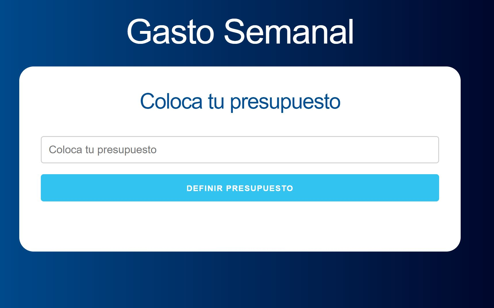
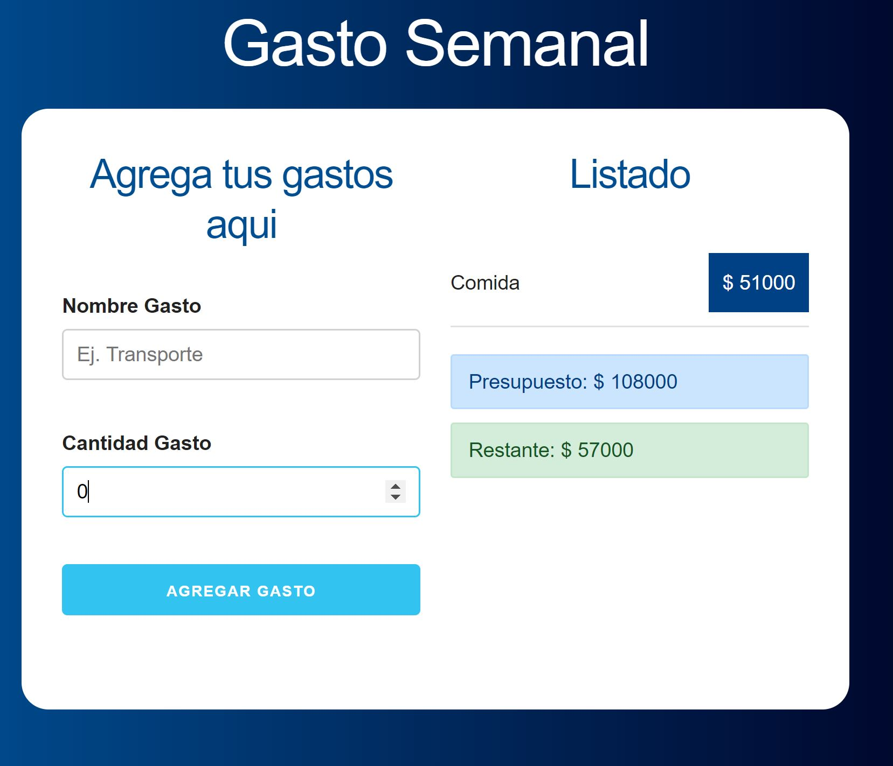

# Presupuesto en REACT JS

trabajo realizado con React JS en el cual se lleva un control del gasto semanal que podria tener una persona manejando presupuesto y su renta diaria.

## Captura de pantalla

This project was bootstrapped with [Create React App](https://github.com/facebookincubator/create-react-app).

